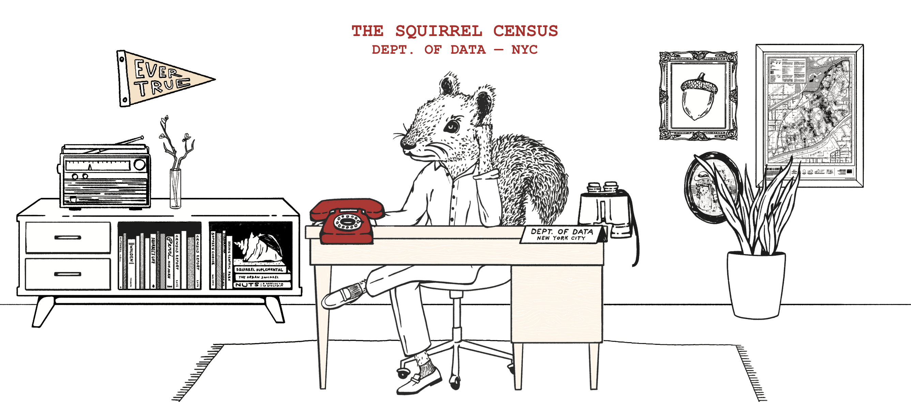

```{r setup, include = FALSE}
knitr::opts_chunk$set(echo = FALSE)
#“default”, “bootstrap”, “cerulean”, “cosmo”, “darkly”, “flatly”, “journal”, “lumen”, “paper”, “readable”, “sandstone”, “simplex”, “spacelab”, “united”, “yeti”
```

## About the dataset

- Data collected for the 2018 Squirrel Census project in NYC
- 3'023 unique squirrel sightings throughout October 2018
- 31 columns including squirrel location, fur color, reaction to humans, etc.

```{r, out.width='95%', fig.align='center', echo = FALSE}
squirrels <- read.csv("data/squirrel_data.csv", na.strings = c("", "NA"))


```

## Sightings on a map

```{r, echo = TRUE, message = FALSE, warning = FALSE}
library(ggmap)

borders <- c(bottom = 40.762, top = 40.8025, left = -73.99, right = -73.94)
map <- get_stadiamap(borders, zoom = 14, maptype = "stamen_terrain")

ggmap(map) +
  geom_point(data = squirrels, 
             aes(x = X, y = Y), 
             size = 0.2) +
  labs(title = "Squirrels in Central Park", 
       x = NULL, 
       y = NULL) +
  theme_minimal()
```

## Squirrel occurence per hectare

```{r cars, echo = TRUE, message = FALSE, warning = FALSE}
library(dplyr)
library(ggplot2)

# Split each hectare XXY (XX: number (1-42), Y: letter (A-I)) into XX and Y
squirrels$XX <- as.numeric(substr(squirrels$Hectare, 1, nchar(squirrels$Hectare) - 1))
squirrels$Y <- substr(squirrels$Hectare, nchar(squirrels$Hectare), nchar(squirrels$Hectare))

# Setting alphabetical order from top to bottom 
squirrels$Y <- factor(squirrels$Y, levels = rev(levels(factor(squirrels$Y))))

squirrels_aggregated <- squirrels |> 
  group_by(XX, Y) |> 
  summarize(squirrel_count = sum(Hectare.Squirrel.Number), 
            .groups = 'drop')

max_count <- max(squirrels_aggregated$squirrel_count)
breaks <- seq(0, max_count, length.out = 11)

hectares <- ggplot(squirrels_aggregated, 
       aes(x = XX, 
           y = Y)) +
  geom_tile(aes(fill = squirrel_count), 
            color = "white") +
  scale_fill_viridis_c(option = "plasma", 
                       breaks = breaks, 
                       labels = round(breaks)) +
  labs(title = "Squirrel occurrences per hectare",
       x = NULL,
       y = NULL,
       fill = "Squirrel Count") +
  theme_minimal() +
  coord_fixed()
```

## Squirrel occurence per hectare

```{r pressure}
hectares
```

## Squirrel shifts

```{r}

```

## Different fur colors of the Central Park squirrels 

```{r}
squirrels$Primary.Fur.Color[is.na(squirrels$Primary.Fur.Color)] <- "Not Available"

ggplot(squirrels, aes(x = Primary.Fur.Color, fill = Primary.Fur.Color)) +
  geom_bar(alpha = 0.8) +
  labs(x = NULL,
       y = NULL) +
  scale_fill_manual(name = NULL,
                    values = c("black", "sienna", "darkgray", "yellow")) +
  theme_minimal()
```


